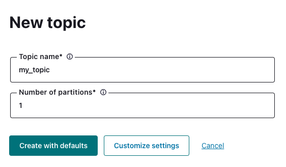
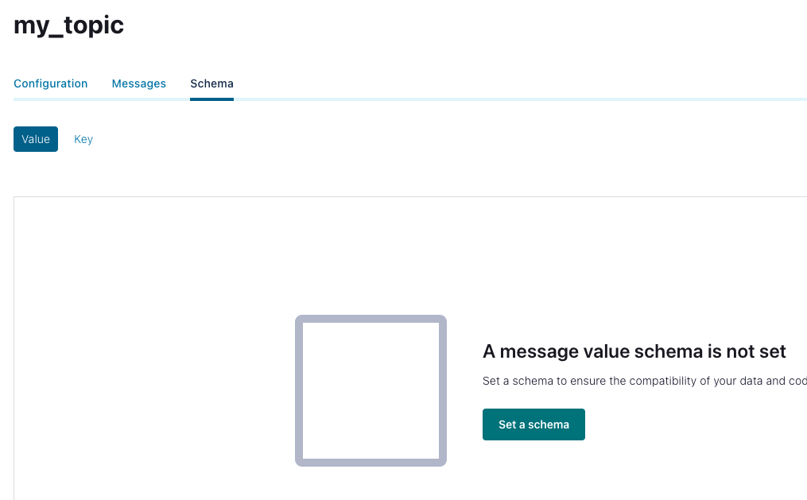

I just needed a simple program for generating random records on my Kafka set up. As I wanted to make it simple and fast this project is based on the [Scala CLI](https://scala-cli.virtuslab.org/) and it includes a docker compose image based on [confluent docker images](https://docs.confluent.io/platform/current/installation/docker/image-reference.html).

## How to use?

Type `docker compose up` and you will get a working kafka cluster with an associate schema registry. Generate a topic and an associate schema and adjust the urls in the project config. 

Type `scala-cli run Producer.scala` and enjoy your messages!

Feel free to modify the existing case class and the `GenericRecord` for sending different messages.